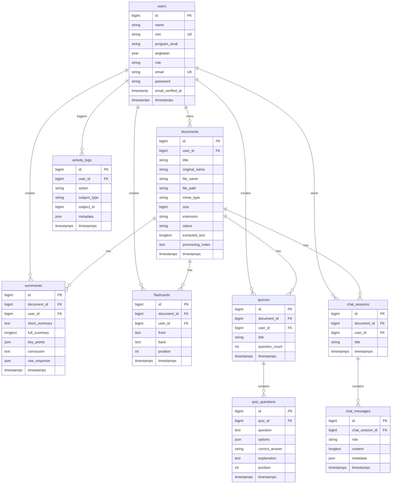

# CampusGPT Architecture

CampusGPT adalah aplikasi Laravel 12 monolith untuk membantu mahasiswa belajar dari dokumen kuliah menggunakan Gemini API. Aplikasi tidak memakai SPA framework; seluruh UI memakai Blade, Tailwind CSS CDN, dan Alpine.js untuk interaksi ringan.

## Layer Sistem

- **Routes**: `routes/web.php` memisahkan route guest, mahasiswa, dan admin.
- **Controllers**: `app/Http/Controllers/Auth`, `Student`, dan `Admin` menangani request web.
- **Models**: Eloquent model menyimpan relasi antar user, dokumen, hasil AI, chat, dan log aktivitas.
- **Services**: `GeminiService` menangani prompt ringkasan, chat dokumen, soal, dan flashcard. `DocumentTextExtractor` mengekstrak teks awal dari PDF/DOCX/PPTX.
- **Repositories**: `DocumentRepository` disediakan untuk query dokumen yang dapat dikembangkan.
- **Policies/Middleware**: `RoleMiddleware` membatasi akses admin/mahasiswa. `DocumentPolicy` mendefinisikan kepemilikan dokumen.
- **Views**: Blade di `resources/views` menyediakan dashboard, auth, dokumen, AI output, dan admin panel.

## Alur Mahasiswa

1. Mahasiswa register dengan nama, NIM, program studi, angkatan, email, dan password.
2. Mahasiswa upload PDF, DOCX, atau PPTX maksimal 20 MB.
3. Dokumen disimpan di storage, metadata masuk ke tabel `documents`.
4. Sistem mencoba mengekstrak teks dan menyimpannya ke `documents.extracted_text`.
5. Mahasiswa dapat membuat ringkasan, soal, flashcard, dan chat dokumen.
6. Semua output AI disimpan ke database dan riwayat aktivitas dicatat di `activity_logs`.

## Alur Admin

1. Admin login dengan role `admin`.
2. Admin melihat statistik user, dokumen, ringkasan, flashcard, soal, dan percakapan AI.
3. Admin melihat grafik penggunaan harian berdasarkan `activity_logs`.
4. Admin dapat mengubah role user dan menghapus user.
5. Admin dapat melihat semua dokumen dan menghapus dokumen bermasalah.

## ERD

## Konfigurasi Penting

- `GEMINI_API_KEY` wajib diisi untuk fitur AI.
- `GEMINI_MODEL` default: `gemini-2.5-flash`.
- `VIEW_COMPILED_PATH` diarahkan ke folder compiled view yang writable di Windows/Laragon.
- PHP production disarankan 8.3+ dengan ekstensi `fileinfo`, `pdo_mysql`, `zip`, `mbstring`, `curl`, dan `openssl`.
