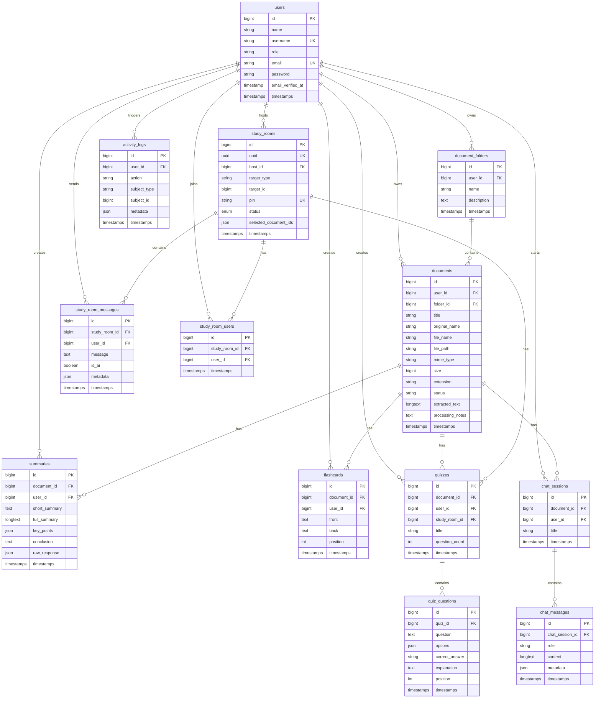

# Arsitektur Ruang Belajar (Aidosen)

Ruang Belajar adalah aplikasi Laravel monolith untuk membantu mahasiswa belajar dari dokumen kuliah menggunakan Gemini API. Aplikasi tidak memakai SPA framework; seluruh UI memakai Blade, Tailwind CSS (Vite / CDN), dan Alpine.js untuk interaksi interaktif yang ringan dan responsif.

## Layer Sistem

- **Routes**: `routes/web.php` memisahkan route guest, mahasiswa, dan admin.
- **Controllers**: 
  - `Auth`: Menangani registrasi, login, dan reset password.
  - `Student`: Menangani fitur belajar utama seperti `ChatController`, `QuizController`, `FlashcardController`, dan `StudyRoomController`.
  - `Admin`: Menangani panel pengelolaan data oleh pengelola/dosen.
- **Models**: Eloquent model menyimpan relasi antar user, dokumen, hasil AI, chat, kuis, flashcard, log aktivitas, dan study room.
- **Services**: 
  - `GeminiService`: Menangani prompt ringkasan, chat dokumen, soal latihan, flashcard, dan streaming chat.
  - `LearningSourceService`: Menyediakan referensi potongan teks dari materi asli dan jawaban fallback jika API limit tercapai.
  - `DocumentTextExtractor`: Mengekstrak teks awal dari PDF/DOCX/PPTX.
- **Events**: 
  - `StudyRoomMessageSent`: Mengirim pesan lengkap yang sudah tersimpan di database.
  - `StudyRoomMessageChunkGenerated`: Mengirim potongan respons streaming AI secara real-time.
- **Real-time Engine**: Menggunakan Laravel Reverb (WebSockets) dengan Laravel Echo di frontend untuk kehadiran pengguna (*presence channel*) dan siaran langsung pesan.
- **Policies/Middleware**: `RoleMiddleware` membatasi akses admin/mahasiswa. `DocumentPolicy` mendefinisikan kepemilikan dokumen.
- **Views**: Blade di `resources/views` menyediakan dashboard, auth, dokumen, AI output, study rooms (Belajar Bareng), dan admin panel.

## Alur Mahasiswa

1. Mahasiswa register dengan nama, username, role `mahasiswa`, email, dan password.
2. Mahasiswa upload PDF, DOCX, PPTX, atau Gambar (PNG/JPG/GIF/WEBP) maksimal 20 MB.
3. Dokumen disimpan di storage private, metadata masuk ke tabel `documents`.
4. Sistem mencoba mengekstrak teks menggunakan `DocumentTextExtractor` dan menyimpannya ke `documents.extracted_text`.
5. Mahasiswa dapat membuat ringkasan, latihan soal, flashcard, atau chat dokumen secara mandiri.
6. Mahasiswa juga dapat membuat **Study Room (Belajar Bareng)**, membagikan PIN unik kepada mahasiswa lain untuk belajar, bertukar pesan secara real-time, dan didampingi AI Co-Pilot yang merespons pertanyaan di chat.
7. Semua output AI disimpan ke database dan riwayat aktivitas dicatat di `activity_logs`.

## Alur Admin

1. Admin login dengan role `admin`.
2. Admin melihat statistik user, dokumen, ringkasan, flashcard, kuis, percakapan AI, dan ruang belajar aktif.
3. Admin melihat grafik penggunaan harian berdasarkan `activity_logs`.
4. Admin dapat mengubah role user dan menghapus user.
5. Admin dapat melihat semua dokumen dan menghapus dokumen bermasalah.

## ERD

## Konfigurasi Penting

- `GEMINI_API_KEY`: Kunci akses API Gemini untuk pemrosesan kecerdasan buatan.
- `GEMINI_MODEL`: Model yang digunakan (default: `gemini-2.5-flash`).
- `STUDY_ROOM_REALTIME`: Aktifkan `true` untuk mengizinkan sinkronisasi pesan real-time menggunakan Laravel Reverb / Pusher.
- `VIEW_COMPILED_PATH`: Diarahkan ke folder compiled view yang writable di Windows/Laragon.
